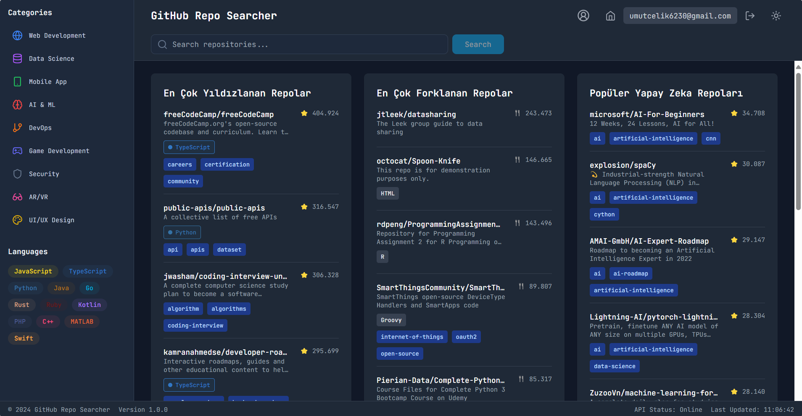

# GitHub Repo Searcher

GitHub Repo Searcher, GitHub depolarını aramak ve keşfetmek için geliştirilmiş modern bir web uygulamasıdır. React, TypeScript ve Tailwind CSS kullanılarak geliştirilmiştir.



## 🚀 Özellikler

- 🔍 GitHub depolarında gerçek zamanlı arama
- 🌓 Koyu/Açık tema desteği
- 🔐 Firebase Authentication ile kullanıcı yönetimi
- 📱 Responsive tasarım
- 🏷️ Kategori ve programlama dili bazlı filtreleme
- ⭐ En popüler repoları görüntüleme
- 🔄 Gerçek zamanlı güncellenen sonuçlar

## 🛠️ Kullanılan Teknolojiler

- React 18
- TypeScript
- Tailwind CSS
- Firebase Authentication
- Vite
- React Router
- Lucide Icons

## 📋 Önkoşullar

- Node.js (v18 veya üzeri)
- npm veya yarn
- Firebase hesabı

## ⚙️ Kurulum

1. Repoyu klonlayın:
```bash
git clone https://github.com/kullaniciadi/github-repo-searcher.git
cd github-repo-searcher
```

2. Bağımlılıkları yükleyin:
```bash
npm install
# veya
yarn install
```

3. Firebase projenizi oluşturun:
   - [Firebase Console](https://console.firebase.google.com)'a gidin
   - Yeni bir proje oluşturun
   - Authentication servisini etkinleştirin ve Email/Password ve Google sign-in metodlarını açın

4. `.env` dosyası oluşturun:
```env
VITE_FIREBASE_API_KEY=your-api-key
VITE_FIREBASE_AUTH_DOMAIN=your-auth-domain
VITE_FIREBASE_PROJECT_ID=your-project-id
VITE_FIREBASE_STORAGE_BUCKET=your-storage-bucket
VITE_FIREBASE_MESSAGING_SENDER_ID=your-messaging-sender-id
VITE_FIREBASE_APP_ID=your-app-id
```

5. Geliştirme sunucusunu başlatın:
```bash
npm run dev
# veya
yarn dev
```

## 🚀 Dağıtım

1. Projeyi derleyin:
```bash
npm run build
# veya
yarn build
```

2. Firebase CLI'ı yükleyin ve giriş yapın:
```bash
npm install -g firebase-tools
firebase login
```

3. Firebase projenizi başlatın:
```bash
firebase init
```

4. Uygulamayı dağıtın:
```bash
npm run firebase
# veya
yarn firebase
```

## 📝 Kullanım

1. Uygulamaya giriş yapın veya kayıt olun
2. Arama çubuğunu kullanarak GitHub depolarını arayın
3. Kategorileri veya programlama dillerini kullanarak sonuçları filtreyin
4. Depo detaylarını görüntülemek için kartlara tıklayın

## 🤝 Katkıda Bulunma

1. Bu repoyu fork edin
2. Yeni bir branch oluşturun (`git checkout -b feature/amazing-feature`)
3. Değişikliklerinizi commit edin (`git commit -m 'feat: Add amazing feature'`)
4. Branch'inizi push edin (`git push origin feature/amazing-feature`)
5. Bir Pull Request oluşturun

## 📄 Lisans

Bu proje MIT lisansı altında lisanslanmıştır. Detaylar için [LICENSE](LICENSE) dosyasına bakın.

## 👏 Teşekkürler

- [React](https://reactjs.org/)
- [Tailwind CSS](https://tailwindcss.com/)
- [Firebase](https://firebase.google.com/)
- [Lucide Icons](https://lucide.dev/)

## 📧 İletişim

Ad Soyad - [[email@example.com](https://x.com/palamut62)](https://x.com/palamut62)

Proje Linki: [https://github.com/palamut62/github-repo-searcher](https://github.com/palamut62/github-repo-searcher)

